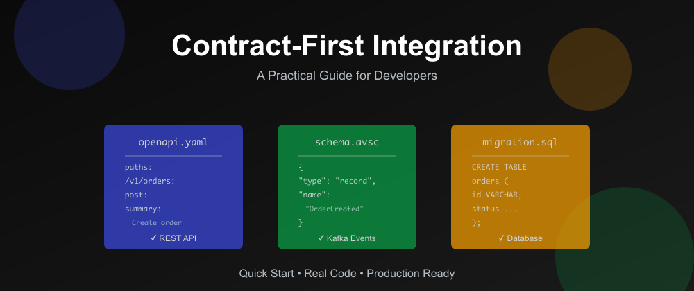

# Contract-First Integration: A Practical Guide for Developers



Ever had that moment where you finish building an API, tell the frontend team "it's ready," and then spend two days debugging why their requests keep failing? Yeah, me too.

Turns out there's a better way: Define the contract first, then build the code to match it. In this guide, I'll show you exactly how to do contract-first integration with Spring Boot, OpenAPI, and Kafka.

No theory. Just practical steps you can use today.

---

## What Is Contract-First Integration?

Simple version: You write the API specification before you write any code.

Instead of:

1. Code the API
2. Test it
3. Document it
4. Hope it matches what consumers expected

You do:

1. Write the contract (OpenAPI spec or Avro schema)
2. Get everyone to agree on it
3. Generate code from the contract
4. Implement the logic

The contract is the single source of truth. Code, tests, and docs all come from it.

---

## Why Should You Care?

Three reasons:

**1. No more "but I thought you meant..."** conversations

When you define the contract upfront, there's no ambiguity. The spec says exactly what fields are required, what types they are, and what errors to expect.

**2. Teams can work in parallel**

Frontend doesn't have to wait for backend. They can generate a client SDK from the contract and develop against a mock
server. When the real API is ready, they just switch the URL. No code changes.

**3. Breaking changes get caught in CI, not production**

You set up automated checks that fail the build if someone tries to remove a required field or change a response type. No more "oops, we broke all the mobile clients" moments.

---

## Quick Start: Your First OpenAPI Contract

Let's build a simple orders API. We'll start with the contract.

Create a file: `contracts/openapi/orders-api.yaml`

```yaml
openapi: 3.2.0
info:
  title: Orders API
  version: 1.0.0
  description: Contract-first REST API for order management

paths:
  /v1/orders:
    post:
      summary: Create a new order
      requestBody:
        required: true
        content:
          application/json:
            schema:
              $ref: '#/components/schemas/CreateOrderRequest'
      responses:
        '201':
          description: Order created successfully
          content:
            application/json:
              schema:
                $ref: '#/components/schemas/OrderResponse'
        '400':
          description: Invalid request
          content:
            application/json:
              schema:
                $ref: '#/components/schemas/ErrorResponse'

  /v1/orders/{orderId}:
    get:
      summary: Get an order by ID
      parameters:
        - name: orderId
          in: path
          required: true
          schema:
            type: string
      responses:
        '200':
          description: Order found
          content:
            application/json:
              schema:
                $ref: '#/components/schemas/OrderResponse'
        '404':
          description: Order not found

components:
  schemas:
    CreateOrderRequest:
      type: object
      required:
        - customerId
        - items
      properties:
        customerId:
          type: string
          example: "CUST-123"
        items:
          type: array
          minItems: 1
          items:
            $ref: '#/components/schemas/OrderItem'

    OrderItem:
      type: object
      required:
        - sku
        - quantity
      properties:
        sku:
          type: string
          example: "SKU-001"
        quantity:
          type: integer
          minimum: 1
          example: 2

    OrderResponse:
      type: object
      required:
        - orderId
        - customerId
        - status
        - items
        - timestamp
      properties:
        orderId:
          type: string
          example: "ORD-10001"
        customerId:
          type: string
        status:
          type: string
          enum: [ CREATED, REJECTED ]
        items:
          type: array
          items:
            $ref: '#/components/schemas/OrderItem'
        timestamp:
          type: string
          format: date-time

    ErrorResponse:
      type: object
      required:
        - code
        - message
        - timestamp
      properties:
        code:
          type: string
          example: "VALIDATION_ERROR"
        message:
          type: string
          example: "items must not be empty"
        timestamp:
          type: string
          format: date-time
```

That's your contract. It defines:

- Two endpoints: POST `/v1/orders` and GET `/v1/orders/{orderId}`
- Request and response structures
- Error responses
- Validation rules (like `minItems: 1` for the items array)

---

## Implementing the API in Spring Boot

Now let's build the actual API. Create a Spring Boot controller:

```java

@RestController
@RequestMapping("/v1/orders")
@RequiredArgsConstructor
@Slf4j
public class OrderController {

    private final OrderService orderService;

    @PostMapping
    public ResponseEntity<OrderResponse> createOrder(
            @Valid @RequestBody CreateOrderRequest request) {

        log.info("Creating order for customer: {}", request.customerId());

        OrderResponse response = orderService.createOrder(request);

        return ResponseEntity
                .status(HttpStatus.CREATED)
                .body(response);
    }

    @GetMapping("/{orderId}")
    public ResponseEntity<OrderResponse> getOrder(@PathVariable String orderId) {
        OrderResponse response = orderService.getOrder(orderId)
                .orElseThrow(() ->
                        new ResourceNotFoundException("Order not found: " + orderId));

        return ResponseEntity.ok(response);
    }
}
```

**Key points:**

- `@Valid` triggers validation based on the contract constraints
- HTTP status codes match what the contract specifies (201 for created, 404 for not found)
- DTOs (CreateOrderRequest, OrderResponse) match the contract schemas exactly

--- 

## Adding Contract Validation to CI

Here's how to catch breaking changes before they reach production.

Add this to your GitHub Actions workflow:

```yaml
name: Validate API Contract

on: [ pull_request ]

jobs:
  contract-validation:
    runs-on: ubuntu-latest
    steps:
      - uses: actions/checkout@v3
        with:
          fetch-depth: 0

      - name: Check for breaking changes
        run: |
          npx openapi-diff \
            origin/main:contracts/openapi/orders-api.yaml \
            HEAD:contracts/openapi/orders-api.yaml \
            --fail-on-breaking
```

Now if someone tries to:

- Remove a required field
- Change a field type
- Remove an endpoint
- Change HTTP status codes

The PR build will fail. Breaking changes get caught in code review.

---

## Contract-First for Kafka Events

APIs are one thing, but what about event-driven systems? Let's look at Kafka.

For Kafka, you need two contracts:

### 1. Topic Semantics (Human-Readable)

Create: `contracts/events/topics.md`

```markdown
## orders.order-created.v1

- Purpose: Emitted when an order is created
- Key: orderId (for partition affinity)
- Delivery: At-least-once (consumers must be idempotent)
- Deduplication: Use eventId field
- DLQ: orders.order-created.v1.dlq
```

This documents the operational behavior.

### 2. Avro Schema (Machine-Validated)

Create: `contracts/events/avro/OrderCreated.v1.avsc`

```json
{
  "type": "record",
  "name": "OrderCreated",
  "namespace": "com.acme.events",
  "fields": [
    {
      "name": "eventId",
      "type": "string",
      "doc": "Unique event ID for deduplication"
    },
    {
      "name": "occurredAt",
      "type": "string",
      "doc": "ISO 8601 timestamp"
    },
    {
      "name": "orderId",
      "type": "string"
    },
    {
      "name": "customerId",
      "type": "string"
    },
    {
      "name": "items",
      "type": {
        "type": "array",
        "items": {
          "type": "record",
          "name": "OrderItem",
          "fields": [
            {
              "name": "sku",
              "type": "string"
            },
            {
              "name": "quantity",
              "type": "int"
            }
          ]
        }
      }
    }
  ]
}
```

---

## Publishing Kafka Events

Here's how to publish events in Spring Boot:

```java

@Component
@RequiredArgsConstructor
@Slf4j
public class OrderEventPublisher {

    private final KafkaTemplate<String, Object> kafkaTemplate;

    public void publishOrderCreated(OrderCreated event) {
        String key = event.getOrderId();

        log.debug("Publishing OrderCreated: orderId={}", key);

        CompletableFuture<SendResult<String, Object>> future =
                kafkaTemplate.send("orders.order-created.v1", key, event);

        future.whenComplete((result, ex) -> {
            if (ex == null) {
                log.info("Published OrderCreated: partition={}, offset={}",
                        result.getRecordMetadata().partition(),
                        result.getRecordMetadata().offset());
            } else {
                log.error("Failed to publish OrderCreated", ex);
            }
        });
    }
}
```

**Why use orderId as the key?**

Kafka partitions messages by key. Using `orderId` ensures all events for the same order go to the same partition, preserving order.

---

## Consuming Kafka Events (The Right Way)

Kafka delivers messages at-least-once, which means duplicates are possible. Your consumer must be idempotent:

```java

@KafkaListener(topics = "orders.order-created.v1", groupId = "billing-service")
public void onOrderCreated(OrderCreated event) {
    // Check if we already processed this event
    if (processedEventsRepo.existsByEventId(event.getEventId())) {
        log.debug("Skipping duplicate event: {}", event.getEventId());
        return;
    }

    // Process the event
    billingService.createInvoice(
            event.getOrderId(),
            event.getCustomerId(),
            event.getItems()
    );

    // Mark as processed
    processedEventsRepo.save(
            new ProcessedEvent(event.getEventId(), Instant.now())
    );
}
```

This pattern prevents duplicate processing. Even if Kafka redelivers the same event, you check the `eventId` and skip it if you've seen it before.

---

## Schema Evolution Done Right

Eventually you'll need to add fields to your events. Here's how to do it without breaking consumers.

**Wrong way (breaks consumers):**

```json
{
  "name": "source",
  "type": "string"
}
```

This makes `source` required. Old events don't have it. New consumers crash when reading old events.

**Right way (backward compatible):**

```json
{
  "name": "source",
  "type": [
    "null",
    "string"
  ],
  "default": null
}
```

Now:

- Old consumers reading new events: They ignore the `source` field
- New consumers reading old events: They get `null` for `source`
- Nobody breaks

Always make new fields optional with defaults.

---

## Setting Up Schema Registry

Schema Registry validates that your schema changes are backward compatible.

In `application.yml`:

```yaml
spring:
  kafka:
    bootstrap-servers: localhost:9092
    producer:
      key-serializer: org.apache.kafka.common.serialization.StringSerializer
      value-serializer: io.confluent.kafka.serializers.KafkaAvroSerializer
      properties:
        schema.registry.url: http://localhost:8081
        auto.register.schemas: true
        use.latest.version: true
```

When your producer starts, it tries to register the schema. If the schema isn't backward compatible with the previous version, registration fails and your service won't start.

This prevents breaking changes from reaching production.

---

## Database Contracts With Flyway

Database schemas are contracts too. Use Flyway to version your migrations.

Create: `src/main/resources/db/migration/V1__create_orders.sql`

```sql
CREATE TABLE orders
(
    id          VARCHAR(32) PRIMARY KEY,
    customer_id VARCHAR(32) NOT NULL,
    status      VARCHAR(16) NOT NULL,
    created_at  TIMESTAMP   NOT NULL DEFAULT now()
);

CREATE TABLE order_items
(
    order_id VARCHAR(32) NOT NULL REFERENCES orders (id),
    sku      VARCHAR(64) NOT NULL,
    quantity INT         NOT NULL CHECK (quantity > 0),
    PRIMARY KEY (order_id, sku)
);

CREATE INDEX idx_orders_customer_id ON orders (customer_id);
```

Flyway runs migrations in order on startup. If someone manually modified the schema, Flyway detects the mismatch and fails the deployment.

---

## Quick Wins Checklist

Here's what you can do this week:

**Day 1: Write one OpenAPI contract**

- Pick your simplest API endpoint
- Write the OpenAPI spec for it
- Validate it with [editor.swagger.io](https://editor.swagger.io)

**Day 2: Set up contract validation in CI**

- Add openapi-diff to your GitHub Actions
- Test it by trying to make a breaking change

**Day 3: Create a mock server**

- Use Prism or Wiremock to serve responses based on your contract
- Give the mock URL to your frontend team

**Day 4: Implement the real API**

- Build the Spring Boot controller that matches the contract
- Run your contract validation to ensure it matches

**Day 5: Measure the difference**

- Count integration bugs before and after
- Measure time to integration

---

## Common Mistakes to Avoid

**Mistake 1: Generating contracts from code**

Don't use annotations to generate OpenAPI specs. Write the spec first, then implement code that matches it.

**Mistake 2: Skipping CI validation**

Contracts are useless if they're not enforced. Always add automated checks.

**Mistake 3: Breaking changes without versioning**

If you need to make a breaking change, create a new version (`/v2/orders`) and deprecate the old one gradually.

**Mistake 4: Forgetting about idempotency**

Always include an `idempotencyKey` field for POST requests and an `eventId` for Kafka events. Retries happen. Your code must handle them gracefully.

---

## Tools That Help

**OpenAPI:**

- [Swagger Editor](https://editor.swagger.io) - Validate your specs
- [Prism](https://stoplight.io/open-source/prism) - Mock server from OpenAPI
- [openapi-generator](https://openapi-generator.tech) - Generate client SDKs
- [openapi-diff](https://www.npmjs.com/package/openapi-diff) - Detect breaking changes

**Kafka:**

- [Confluent Schema Registry](https://docs.confluent.io/platform/current/schema-registry/index.html) - Schema validation
- [Avro Tools](https://avro.apache.org/docs/current/gettingstartedjava.html) - Generate Java classes from schemas

**Database:**

- [Flyway](https://flywaydb.org) - Database migrations
- [Liquibase](https://www.liquibase.org) - Alternative to Flyway

---

## What's Your Experience?

Have you tried contract-first integration? What worked? What didn't?

Drop a comment below. I'd love to hear about your experiences and answer any questions.

---

**Want the full code?**

Check out the complete working example: [github.com/wallaceespindola/contract-first-integrations](https://github.com/wallaceespindola/contract-first-integrations)

It includes:

- Full OpenAPI specs
- Spring Boot implementation
- Kafka producer and consumer with Avro
- Flyway migrations
- CI/CD validation setup

---

If this helped you, hit the ❤️ button and share it with your team. Follow me for more practical Spring Boot and Kafka tutorials.

**Related posts you might like:**

- [Generating Realistic Fake Data in Java with Quarkus, DataFaker & EasyRandom](https://dev.to/wallaceespindola/generating-realistic-fake-data-in-java-with-quarkus-datafaker-easyrandom-5gi8)
- [Cassandra vs PostgreSQL: A Developer’s Guide to Choose the Right Database](https://dev.to/wallaceespindola/cassandra-vs-postgresql-a-developers-guide-to-choose-the-right-database-3nhi)
- [FastAPI Unleashed: Building Modern and High-Performance APIs](https://dev.to/wallaceespindola/fastapi-your-fast-and-modern-framework-for-apis-3mmo)

---

**Need more tech insights?**

Check out my [GitHub](https://github.com/wallaceespindola), [LinkedIn](https://www.linkedin.com/in/wallaceespindola/), and [Speaker Deck](https://speakerdeck.com/wallacese).

Happy coding!
