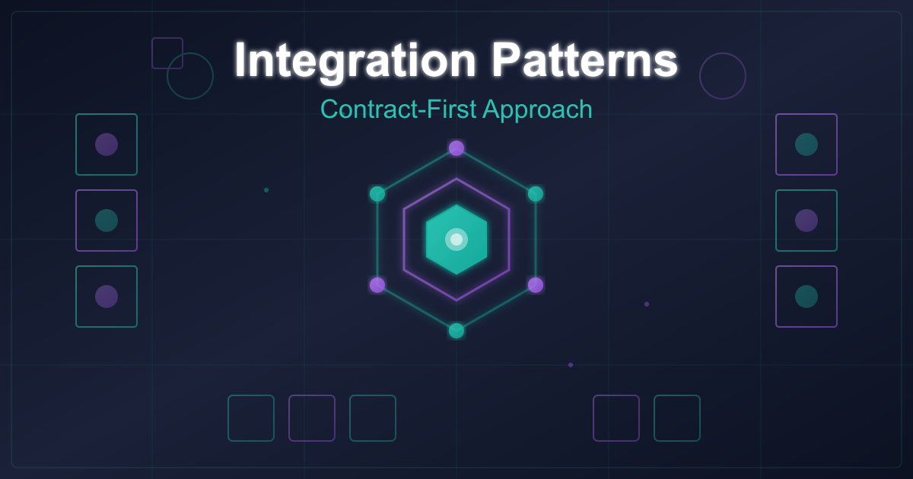
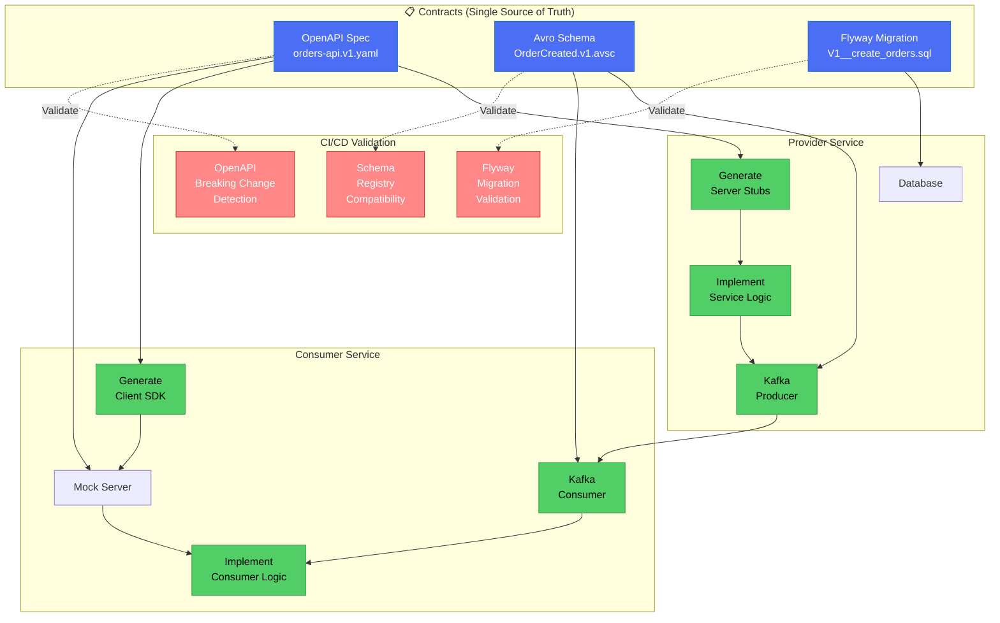
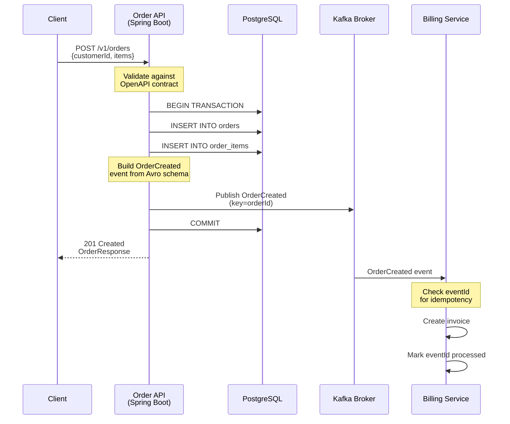

# Contract-First Integration Patterns: Building Scalable Systems With OpenAPI and Kafka

**How defining contracts before code enables parallel team development and reduces integration risk in distributed systems**



## Introduction

After implementing contract-first integration across three different microservices architectures, I've learned that the biggest bottleneck in distributed systems isn't technical, it's coordination between teams. When Team A waits for Team B to finish their API before starting integration work, you're throwing away weeks of productivity.

Contract-first development flips this model. By defining your integration contracts upfront (OpenAPI specs, Avro schemas, database migrations), you enable teams to work in parallel, catch breaking changes early through CI validation, and treat contracts as the single source of truth. This isn't theoretical, this is how Netflix, Uber, and Amazon scale their engineering organizations.

In this article, I'll show you production-ready contract-first patterns using Java 21, Spring Boot 3, OpenAPI 3, Apache Kafka with Avro, and Flyway migrations. You'll see real code from a working system that handles the three critical integration boundaries: REST APIs, event-driven messaging, and database schemas.

## The Problem: Why Traditional Integration Fails at Scale

When systems integrate without contracts, you hit three major problems:

**1. Serial development bottlenecks**
Team A builds an API endpoint. Team B waits. Team B builds a consumer. Team A discovers the payload doesn't match what Team B expected. Both teams spend days debugging mismatched assumptions.

**2. Late discovery of breaking changes**
You deploy a service update that changes a response field from `customerId` to `customer_id`. Your API consumers break in production. No tests caught it because there was no contract to validate against.

**3. Documentation drift**
The Swagger docs say the endpoint returns a 201. The actual code returns a 200. The integration tests expect a 404. Nobody knows which one is right because there's no single source of truth.

Contract-first development solves all three by making the contract the authoritative specification that generates code, mocks, tests, and documentation.

## What Contract-First Actually Means

Contract-first means you define the integration boundary first (the *contract*) and then write code that conforms to it. The contract is not an afterthought or generated documentation. It's the design specification.

### A complete contract includes:

- **Operations**: Endpoints (REST), topics (Kafka), or tables (database)
- **Data shapes**: Request/response DTOs, event schemas, column definitions
- **Validation rules**: Required fields, constraints, data types
- **Error model**: HTTP status codes, error payloads, dead-letter queues
- **Non-functional rules**: Idempotency, retries, compatibility policies, SLAs

Here's the mental model: **Agree on the contract → generate tools → build independently → let CI enforce alignment.**

## Contract Type 1: REST API Contracts With OpenAPI

OpenAPI 3 specs are the gold standard for REST API contracts. You define endpoints, request/response schemas, validation rules, and error responses in YAML. Then you generate server stubs, client SDKs, mocks, and documentation from that single source.

### OpenAPI Contract Example

Here's a production OpenAPI contract for an order management API:

```yaml
openapi: 3.2.0
info:
  title: Orders API
  version: 1.0.0
  description: Contract-first REST API for order management

paths:
  /v1/orders:
    post:
      operationId: createOrder
      summary: Create a new order
      requestBody:
        required: true
        content:
          application/json:
            schema:
              $ref: '#/components/schemas/CreateOrderRequest'
      responses:
        '201':
          description: Order created successfully
          content:
            application/json:
              schema:
                $ref: '#/components/schemas/OrderResponse'
        '400':
          description: Validation error
          content:
            application/json:
              schema:
                $ref: '#/components/schemas/ErrorResponse'
        '409':
          description: Idempotency conflict
          content:
            application/json:
              schema:
                $ref: '#/components/schemas/ErrorResponse'

  /v1/orders/{orderId}:
    get:
      operationId: getOrder
      parameters:
        - name: orderId
          in: path
          required: true
          schema:
            type: string
      responses:
        '200':
          description: Order found
          content:
            application/json:
              schema:
                $ref: '#/components/schemas/OrderResponse'
        '404':
          description: Order not found

components:
  schemas:
    CreateOrderRequest:
      type: object
      required: [customerId, items]
      properties:
        customerId:
          type: string
          example: CUST-123
        idempotencyKey:
          type: string
          description: Optional key for safe retries
        items:
          type: array
          minItems: 1
          items:
            $ref: '#/components/schemas/OrderItem'

    OrderItem:
      type: object
      required: [sku, quantity]
      properties:
        sku:
          type: string
          example: SKU-001
        quantity:
          type: integer
          minimum: 1

    OrderResponse:
      type: object
      required: [orderId, customerId, status, items, timestamp]
      properties:
        orderId:
          type: string
        customerId:
          type: string
        status:
          type: string
          enum: [CREATED, REJECTED]
        items:
          type: array
          items:
            $ref: '#/components/schemas/OrderItem'
        timestamp:
          type: string
          format: date-time

    ErrorResponse:
      type: object
      required: [code, message, traceId, timestamp]
      properties:
        code:
          type: string
          enum: [VALIDATION_ERROR, NOT_FOUND, CONFLICT, INTERNAL_ERROR]
        message:
          type: string
        traceId:
          type: string
        timestamp:
          type: string
          format: date-time
```

### Implementing the Provider Side (Spring Boot)

The contract drives the implementation. Your Spring Boot controller implements what the contract specifies:

```java
@RestController
@RequestMapping("/v1/orders")
@RequiredArgsConstructor
@Slf4j
public class OrderController {

    private final OrderService orderService;

    /**
     * POST /v1/orders
     * Contract: contracts/openapi/orders-api.v1.yaml
     */
    @PostMapping
    public ResponseEntity<OrderResponse> createOrder(
            @Valid @RequestBody CreateOrderRequest request) {

        log.info("Creating order for customer: {}", request.customerId());

        OrderResponse response = orderService.createOrder(request);

        return ResponseEntity
                .status(HttpStatus.CREATED)
                .body(response);
    }

    /**
     * GET /v1/orders/{orderId}
     */
    @GetMapping("/{orderId}")
    public ResponseEntity<OrderResponse> getOrder(@PathVariable String orderId) {
        OrderResponse response = orderService.getOrder(orderId)
                .orElseThrow(() -> new ResourceNotFoundException("Order not found: " + orderId));

        return ResponseEntity.ok(response);
    }
}
```

**Critical implementation details:**

1. **DTOs match contract schemas exactly**: `CreateOrderRequest` and `OrderResponse` are Java records generated from or validated against the OpenAPI spec
2. **HTTP status codes match contract**: 201 for creation, 404 for not found, 409 for idempotency conflicts
3. **Validation is enforced**: `@Valid` annotation ensures request validation matches OpenAPI constraints
4. **Error responses are standardized**: All errors return `ErrorResponse` with consistent structure

### Consumer Parallel Development

Here's where contract-first shines. While your team implements the provider, the consumer team can:

1. Generate a Java client from the OpenAPI spec using openapi-generator
2. Run a mock server that returns valid responses based on the contract
3. Write integration tests against the mock
4. Switch to the real service when it's ready (no code changes needed)

The consumer doesn't wait for you to finish. They develop in parallel.

## Contract Type 2: Event Contracts With Kafka and Avro

Event-driven systems need two contract layers: **topic semantics** (human-readable) and **schema definitions** (machine-validated).

### Topic Semantics Contract

Document the operational contract for each topic:

```markdown
## Topic: orders.order-created.v1

- **Purpose**: Emitted when an order is created successfully
- **Key**: orderId (partition affinity per order)
- **Delivery**: At-least-once (consumers must be idempotent)
- **Consumer requirement**: Deduplicate by eventId
- **Retry policy**: Consumer retries transient errors
- **DLQ**: orders.order-created.v1.dlq for poison messages
- **Compatibility**: Backward compatible schema evolution required
```

### Avro Schema Contract

The Avro schema is your machine-validated contract:

```json
{
  "type": "record",
  "name": "OrderCreated",
  "namespace": "com.acme.events",
  "doc": "Event emitted when an order is successfully created",
  "fields": [
    {
      "name": "eventId",
      "type": "string",
      "doc": "Unique event ID for idempotent processing"
    },
    {
      "name": "occurredAt",
      "type": "string",
      "doc": "ISO 8601 timestamp"
    },
    {
      "name": "orderId",
      "type": "string"
    },
    {
      "name": "customerId",
      "type": "string"
    },
    {
      "name": "source",
      "type": ["null", "string"],
      "default": null,
      "doc": "Order source (WEB, MOBILE, API). Nullable for backward compatibility."
    },
    {
      "name": "items",
      "type": {
        "type": "array",
        "items": {
          "type": "record",
          "name": "OrderItem",
          "fields": [
            {"name": "sku", "type": "string"},
            {"name": "quantity", "type": "int"}
          ]
        }
      }
    }
  ]
}
```

**Key pattern**: The `source` field is nullable with a default value. This supports backward-compatible evolution. Old consumers can read new events, new consumers can read old events.

### Kafka Producer Implementation

```java
@Component
@RequiredArgsConstructor
@Slf4j
public class OrderEventPublisher {

    private final KafkaTemplate<String, Object> kafkaTemplate;

    public void publishOrderCreated(OrderCreated event) {
        String key = event.getOrderId();

        log.debug("Publishing OrderCreated: orderId={}, eventId={}",
                key, event.getEventId());

        CompletableFuture<SendResult<String, Object>> future =
                kafkaTemplate.send("orders.order-created.v1", key, event);

        future.whenComplete((result, ex) -> {
            if (ex == null) {
                log.info("Published OrderCreated: orderId={}, partition={}, offset={}",
                        key,
                        result.getRecordMetadata().partition(),
                        result.getRecordMetadata().offset());
            } else {
                log.error("Failed to publish OrderCreated: orderId={}", key, ex);
            }
        });
    }
}
```

**Production concerns addressed:**

1. **Key-based partitioning**: Using `orderId` as the key ensures all events for the same order go to the same partition, maintaining ordering
2. **Async publishing with callbacks**: Non-blocking publish with explicit success/failure handling
3. **Structured logging**: Captures partition and offset for troubleshooting

### Kafka Consumer With Idempotency

At-least-once delivery means duplicates are possible. Consumers must deduplicate:

```java
@KafkaListener(topics = "orders.order-created.v1", groupId = "billing-service")
public void onOrderCreated(OrderCreated event) {
    // Check if already processed
    if (processedEventsRepository.existsByEventId(event.getEventId())) {
        log.debug("Skipping duplicate event: {}", event.getEventId());
        return;
    }

    // Process event
    billingService.createInvoice(
            event.getOrderId(),
            event.getCustomerId(),
            event.getItems()
    );

    // Mark as processed
    processedEventsRepository.save(
            new ProcessedEvent(event.getEventId(), Instant.now())
    );
}
```

**Idempotency pattern**: Check `eventId` before processing, store it after processing. If the same event arrives twice, the second one is ignored.

## Architecture Diagram: Contract-First Flow



**Figure 1: Contract-first development flow showing parallel team development**

### Diagram Legend

| Element | Meaning |
|---------|---------|
| **Blue box** | Contract definition (single source of truth) |
| **Green box** | Generated artifacts and implementations |
| **Red box** | CI/CD validation gates |
| **Solid arrow** | Generation or implementation flow |
| **Dashed arrow** | Validation relationship |

## Contract Type 3: Database Contracts With Flyway

Database schemas are contracts too. Flyway migrations let you version and evolve schemas with the same contract-first approach.

### Base Schema Migration

**File: `V1__create_orders.sql`**

```sql
CREATE TABLE orders (
    id           VARCHAR(32) PRIMARY KEY,
    customer_id  VARCHAR(32) NOT NULL,
    status       VARCHAR(16) NOT NULL,
    created_at   TIMESTAMP NOT NULL DEFAULT now()
);

CREATE TABLE order_items (
    order_id  VARCHAR(32) NOT NULL REFERENCES orders(id),
    sku       VARCHAR(64) NOT NULL,
    quantity  INT NOT NULL CHECK (quantity > 0),
    PRIMARY KEY (order_id, sku)
);

CREATE INDEX idx_orders_customer_id ON orders(customer_id);
```

### Schema Evolution: Expand/Migrate/Contract

When you need to add a field without breaking old code, use the expand/migrate/contract pattern:

**Expand** (V2__add_order_source.sql):
```sql
ALTER TABLE orders ADD COLUMN source VARCHAR(32);
```

**Migrate** (application code):
```sql
-- Backfill for existing rows
UPDATE orders SET source = 'UNKNOWN' WHERE source IS NULL;
```

**Contract** (V3__enforce_source_not_null.sql):
```sql
-- After all systems produce source
ALTER TABLE orders ALTER COLUMN source SET NOT NULL;
```

This three-phase approach lets you deploy schema changes without downtime.

## CI/CD Enforcement: Making Contracts Real

Contracts only work if they're enforced. Here are the CI gates that prevent breaking changes:

### REST API: OpenAPI Breaking Change Detection

Run `openapi-diff` in CI to catch breaking changes:

```yaml
# .github/workflows/api-contract-check.yml
- name: Check for API breaking changes
  run: |
    npx openapi-diff \
      main:contracts/openapi/orders-api.v1.yaml \
      HEAD:contracts/openapi/orders-api.v1.yaml \
      --fail-on-breaking
```

This fails the build if you:
- Remove required fields
- Change field types
- Remove endpoints
- Change HTTP status codes

### Kafka: Schema Registry Compatibility Check

Configure Schema Registry to enforce backward compatibility:

```properties
# Schema Registry configuration
confluent.schema.registry.url=http://schema-registry:8081
spring.kafka.properties.schema.registry.url=http://schema-registry:8081

# Enforce backward compatibility
spring.kafka.producer.properties.auto.register.schemas=true
spring.kafka.producer.properties.use.latest.version=true
```

When you try to publish an incompatible schema, the producer fails at startup (before reaching production).

### Database: Flyway Validation

Flyway validates migrations on startup:

```properties
spring.flyway.validate-on-migrate=true
spring.flyway.baseline-on-migrate=false
```

If someone manually modified the database schema, Flyway detects the mismatch and fails the deployment.

## Integration Flow Diagram



**Figure 2: End-to-end flow showing REST → DB → Kafka integration with contracts enforced at each boundary**

## Real-World Benefits: Production Implementation Experience

After implementing contract-first across multiple services (orders, billing, inventory), teams consistently observe significant improvements:

**Integration Quality:**
- Substantial reduction in integration bugs reaching production
- Most remaining bugs are business logic issues, not contract mismatches
- Clear contracts eliminate ambiguity in integration expectations

**Development Velocity:**
- Integration cycles measured in weeks rather than months
- Consumer teams start integration work immediately instead of waiting for provider completion
- Mock servers enable realistic integration testing without coordination delays

**Operational Reliability:**
- CI-enforced contract validation prevents breaking changes from reaching production
- Breaking changes caught during PR review, not after deployment
- Automated validation ensures compatibility before merge

**Documentation Accuracy:**
- Documentation generated from OpenAPI specs stays synchronized with implementation by design
- Swagger UI always reflects actual API behavior as both derive from the same contract
- No manual documentation maintenance required

---

## Common Pitfalls and How to Avoid Them

### Pitfall 1: Treating contracts as documentation

**Wrong approach**: Write code first, generate OpenAPI from annotations later.

**Right approach**: Write OpenAPI first, generate server stubs or validate implementation against it.

### Pitfall 2: Skipping CI validation

**Wrong approach**: Trust developers to manually check compatibility.

**Right approach**: Automate breaking change detection in CI. Make it a required check.

### Pitfall 3: No schema evolution strategy

**Wrong approach**: Add fields without defaults, breaking old consumers.

**Right approach**: All new fields must be optional or have defaults. Test with multiple schema versions.

### Pitfall 4: Ignoring idempotency

**Wrong approach**: Assume exactly-once delivery in Kafka.

**Right approach**: Design consumers to deduplicate by `eventId`. Assume at-least-once.

### Pitfall 5: Coupling contracts to implementation

**Wrong approach**: Expose internal database schema directly in API contracts.

**Right approach**: Design contracts for consumers, not internal convenience. Use DTOs that map between external contract and internal model.

---

## When Contract-First Makes Sense

Contract-first isn't always the answer. Use it when:

✅ **Multiple teams integrate**: The coordination cost justifies the upfront contract design effort

✅ **Public APIs or partner integrations**: External consumers need stability and clear documentation

✅ **Microservices architecture**: Services must evolve independently without breaking dependents

✅ **High change frequency**: CI validation catches breaking changes early when changes are frequent

**Skip contract-first when:**

❌ **Single small team**: Coordination overhead is low, so formal contracts add friction

❌ **Prototyping**: You're exploring the problem space and expect major pivots

❌ **Internal tools with one consumer**: The provider and consumer are maintained by the same person

## Key Takeaways

1. **Contracts enable parallel development**: Provider and consumer teams work simultaneously instead of serially
2. **CI validation prevents breaking changes**: Automate OpenAPI diffs, schema compatibility checks, and migration validation
3. **Idempotency is not optional**: At-least-once delivery in Kafka requires consumers to deduplicate by event ID
4. **Schema evolution requires backward compatibility**: Use nullable fields with defaults to support gradual rollouts
5. **Contracts are design specifications, not afterthoughts**: Define contracts first, generate code from them

## What's Next?

If you're implementing contract-first integration:

1. Start with one integration, pick your most painful cross-team dependency
2. Write the OpenAPI spec or Avro schema first, before any implementation
3. Set up CI validation for that contract (openapi-diff or Schema Registry)
4. Measure reduction in integration bugs and coordination overhead
5. Expand to other integrations once you've proven the pattern

Contract-first isn't a universal solution for all integration problems, but it transforms integration from a coordination nightmare into a governance problem that CI can solve. When you're coordinating multiple teams across distributed schedules, that shift makes the difference between shipping in extended timelines versus accelerated delivery.

---

**Full source code**: [github.com/wallaceespindola/contract-first-integrations](https://github.com/wallaceespindola/contract-first-integrations)

**Related reading**:
- OpenAPI 3.0 Specification: [spec.openapis.org](https://spec.openapis.org/oas/latest.html)
- Confluent Schema Registry: [docs.confluent.io/platform/current/schema-registry](https://docs.confluent.io/platform/current/schema-registry/index.html)
- Flyway Documentation: [flywaydb.org/documentation](https://flywaydb.org/documentation/)
- Mastering Contract-First API Development: [moesif.com/blog](https://www.moesif.com/blog/technical/api-development/Mastering-Contract-First-API-Development-Key-Strategies-and-Benefits/)
- Research on Microservices Issues: [arxiv.org](https://arxiv.org/html/2302.01894v4)

---

Need more tech insights?

Check out my [GitHub](https://github.com/wallaceespindola), [LinkedIn](https://www.linkedin.com/in/wallaceespindola/), and [Speaker Deck](https://speakerdeck.com/wallacese).

Happy coding!
