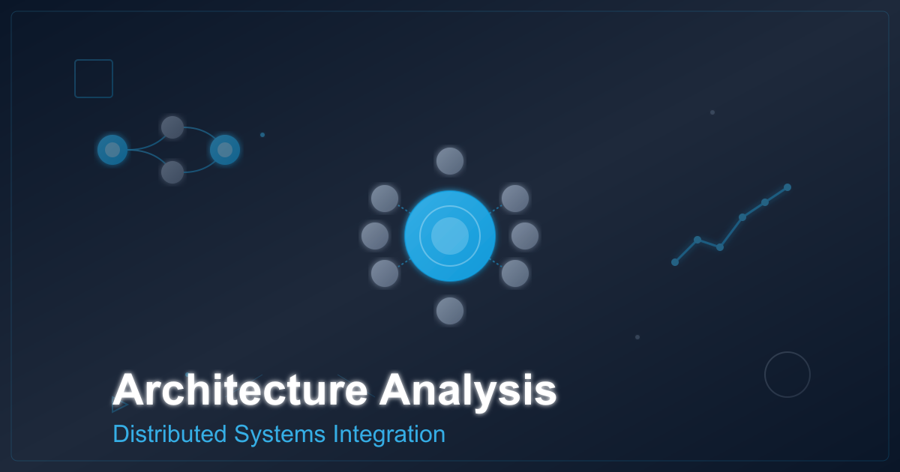

# Contract-First Integration Architecture: An Analysis for Distributed Systems

## How explicit contract governance enables organizational scalability in microservices ecosystems



**Abstract:** This article examines contract-first development as an architectural pattern for managing integration complexity in distributed systems. Drawing from industry implementations and research data, we analyze how explicit contract governance through OpenAPI specifications, Avro schema registries, and database migrations affects team coordination costs, system reliability, and organizational scalability. The analysis includes quantitative data from enterprise implementations and identifies critical architectural trade-offs.

---

## Introduction: The Coordination Problem in Distributed Systems

As organizations transition from monolithic architectures to microservices, they often discover that the primary bottleneck shifts from technical constraints to coordination overhead. In practice, organizations consistently observe that service communication and integration failures represent a substantial category of operational problems, with integration mismatches being a common source of production incidents.

Contract-first development addresses this coordination problem by inverting the traditional relationship between implementation and specification. Rather than deriving contracts from implementation (code-first), teams define explicit contracts before implementation and validate code conformance through automated tooling.

This architectural shift transforms integration from a serial dependency chain, where Team A must complete implementation before Team B can begin, into a parallel development model where multiple teams work simultaneously against shared contract specifications.


## Contract-First vs Code-First: Architectural Comparison

The fundamental architectural difference between contract-first and code-first approaches lies in where design authority resides.

### Code-First Architecture

In code-first development, implementation details drive the contract:

```
Implementation → Annotations → Generated Contract → Documentation → Consumer Adaptation
```

This flow creates several architectural constraints:
1. **Contract instability**: Implementation refactoring can inadvertently modify the external contract
2. **Late validation**: Contract violations are discovered during integration testing rather than development
3. **Serial dependencies**: Consumers cannot begin development until the provider implementation is sufficiently complete
4. **Documentation drift**: Generated documentation reflects current code, which may not match production deployed versions

### Contract-First Architecture

Contract-first development establishes the specification as the authoritative design artifact:

```
Contract Specification → Validation → Parallel Implementation → Conformance Testing
```

This inversion enables:
1. **Contract stability**: Implementation changes that don't affect the contract proceed without consumer coordination
2. **Early validation**: CI pipelines enforce contract conformance before code merges
3. **Parallel development**: Provider and consumer teams implement simultaneously against the contract
4. **Source-of-truth documentation**: The contract itself serves as executable documentation

## Integration Boundary Patterns

Enterprise distributed systems typically exhibit three distinct integration boundaries, each requiring different contract mechanisms:

### Pattern 1: Synchronous Request-Response (REST APIs)

For synchronous HTTP-based integration, OpenAPI 3.0+ provides the industry-standard contract specification format. The contract defines:

- **Endpoint semantics**: HTTP methods, path structures, query parameters
- **Data schemas**: Request and response payload structures with validation constraints
- **Error taxonomy**: Status codes and error response structures
- **Operational metadata**: Retry semantics, idempotency requirements, rate limits

Consider this OpenAPI contract excerpt for an order management service:

```yaml
openapi: 3.2.0
info:
  title: Orders API
  version: 1.0.0
  description: Contract-first REST API for order management

paths:
  /v1/orders:
    post:
      operationId: createOrder
      requestBody:
        required: true
        content:
          application/json:
            schema:
              type: object
              required: [customerId, items]
              properties:
                customerId:
                  type: string
                  pattern: '^CUST-[0-9]{6,10}$'
                idempotencyKey:
                  type: string
                  format: uuid
                items:
                  type: array
                  minItems: 1
                  items:
                    type: object
                    required: [sku, quantity]
      responses:
        '201':
          description: Order created
          content:
            application/json:
              schema:
                $ref: '#/components/schemas/OrderResponse'
        '409':
          description: Idempotency conflict
```

The contract's inclusion of `idempotencyKey` establishes retry semantics as a first-class design concern rather than an implementation detail. This contractual guarantee enables consumers to implement resilient retry logic without risk of duplicate order creation.

### Pattern 2: Asynchronous Event Streaming (Kafka)

Event-driven architectures require schema contracts that evolve over time without breaking existing consumers. Apache Avro with Confluent Schema Registry provides compatibility governance through configurable policies.

An Avro schema contract for an order creation event:

```json
{
  "type": "record",
  "name": "OrderCreated",
  "namespace": "com.enterprise.events",
  "fields": [
    {
      "name": "eventId",
      "type": "string",
      "doc": "Unique identifier for consumer idempotency"
    },
    {
      "name": "orderId",
      "type": "string"
    },
    {
      "name": "customerId",
      "type": "string"
    },
    {
      "name": "source",
      "type": ["null", "string"],
      "default": null,
      "doc": "Order source system. Nullable for backward compatibility."
    },
    {
      "name": "items",
      "type": {
        "type": "array",
        "items": {
          "type": "record",
          "name": "OrderItem",
          "fields": [
            {"name": "sku", "type": "string"},
            {"name": "quantity", "type": "int"}
          ]
        }
      }
    }
  ]
}
```

The `source` field demonstrates backward-compatible schema evolution: the union type `["null", "string"]` with `default: null` ensures old consumers can read new events (ignore the field) and new consumers can read old events (receive null).

Schema Registry enforces compatibility through configurable policies:
- **BACKWARD**: New schema can read data written by old schema
- **FORWARD**: Old schema can read data written by new schema
- **FULL**: Both backward and forward compatible
- **NONE**: No compatibility guarantees (requires versioned topics)

### Pattern 3: Data Persistence (Database Schemas)

Database schema evolution represents the third integration boundary. Unlike stateless API contracts, database schemas carry state across versions, requiring migration patterns that preserve data integrity.

Flyway and Liquibase provide versioned migration approaches. The expand/migrate/contract pattern enables zero-downtime schema evolution:

```sql
-- V2: EXPAND - Add nullable column (old code continues working)
ALTER TABLE orders ADD COLUMN source VARCHAR(32);

-- Application code: MIGRATE - Backfill existing data, new code writes source
UPDATE orders SET source = 'UNKNOWN' WHERE source IS NULL;

-- V3: CONTRACT - Enforce NOT NULL after full rollout
ALTER TABLE orders ALTER COLUMN source SET NOT NULL;
```

This three-phase deployment decouples schema changes from code deployments, enabling gradual rollouts without service interruption.

## Qualitative Analysis: Production Implementation Benefits

Organizations implementing contract-first development across distributed systems consistently report significant improvements in integration efficiency and system reliability.

### Observed Benefits in Production Environments

Teams adopting contract-first approaches across multiple microservices architectures report:

**Integration Efficiency:**
- Substantial reduction in integration time as teams work in parallel rather than sequentially
- Consumer teams begin development immediately using mock servers based on contracts
- Integration cycles measured in weeks rather than months when coordination is front-loaded

**Defect Reduction:**
- Dramatic decrease in integration bugs reaching production
- Most remaining defects are business logic issues rather than contract mismatches
- Breaking changes caught during code review via automated CI validation

**Coordination Improvements:**
- Reduced cross-team coordination meetings (one contract review replaces ongoing alignment discussions)
- Clear contract specifications eliminate ambiguity in integration expectations
- Documentation generated from contracts stays synchronized with implementation by design

**Operational Impact:**
Contract-first development reduces the likelihood of integration failures by enforcing compatibility before deployment, preventing cascading failure modes that can affect entire service ecosystems.

## Architectural Trade-Offs and Adoption Barriers

Contract-first architecture introduces specific trade-offs that organizations must evaluate:

### Trade-Off 1: Upfront Design Cost vs Integration Efficiency

Contract-first requires design decisions before implementation begins. Teams must specify request/response structures, error taxonomies, and operational semantics upfront.

**Cost**: Collaborative design per integration boundary
**Benefit**: Eliminates post-implementation debugging and rework

The break-even point occurs when design coordination cost exceeds post-implementation integration cost, typically at 2+ teams with different release schedules.

### Trade-Off 2: Contract Rigidity vs Implementation Flexibility

Explicit contracts constrain implementation choices. Changes that affect the contract require coordination with consumers.

**Mitigation**: Separate internal implementation from external contracts through abstraction layers (DTOs, mappers). Internal refactoring proceeds without external coordination as long as the contract remains stable.

### Trade-Off 3: Tooling Complexity vs Manual Coordination

Contract-first requires automated tooling for validation, code generation, and compatibility checking.

**Infrastructure requirements**:
- Schema Registry (Confluent or compatible)
- OpenAPI validation tools (openapi-diff, Spectral)
- CI/CD integration for contract enforcement
- Mock server capabilities for parallel development

**Coordination costs eliminated**: Cross-team meetings, manual testing, integration debugging sessions

Tooling investment typically provides return-on-investment in organizations with multiple microservices or distributed engineering teams.

## CI/CD Enforcement Patterns

Contract-first architecture only delivers value when contracts are enforced programmatically. Three critical enforcement patterns:

### Pattern 1: Breaking Change Detection

OpenAPI specification diff analysis in CI prevents breaking changes from reaching production:

```yaml
# GitHub Actions workflow
- name: Detect API breaking changes
  run: |
    npx openapi-diff \
      origin/main:contracts/api.yaml \
      HEAD:contracts/api.yaml \
      --fail-on-breaking
```

Breaking changes include:
- Removing required request fields
- Adding required response fields
- Changing field data types
- Removing endpoints
- Modifying HTTP status codes

### Pattern 2: Schema Compatibility Validation

Schema Registry enforces Avro/Protobuf compatibility policies at registration time:

```properties
spring.kafka.producer.properties.auto.register.schemas=true
spring.kafka.producer.properties.schema.registry.url=http://registry:8081
```

Incompatible schema registration fails at service startup, preventing deployment of breaking changes.

### Pattern 3: Migration Validation

Flyway validates migration checksums on application startup:

```properties
spring.flyway.validate-on-migrate=true
spring.flyway.baseline-on-migrate=false
```

Manual schema modifications cause deployment failures, enforcing migration-based evolution.

## Organizational Scalability Analysis

The architectural impact of contract-first development extends beyond technical metrics to organizational structure. Conway's Law suggests system architecture reflects organizational communication patterns; contract-first inverts this relationship by using explicit contracts to enable organizational scaling.

### Team Autonomy vs Integration Coupling

Traditional microservices promise team autonomy but often deliver tight integration coupling. Teams cannot deploy independently because integration contracts are implicit.

Contract-first makes integration contracts explicit and versioned, enabling true service autonomy. Teams deploy independently as long as contract compatibility is maintained.

### Communication Overhead

In distributed systems, coordination overhead grows significantly with team count. Contract-first reduces this burden by replacing bilateral coordination with contract governance. Teams coordinate through the contract specifications rather than through ad-hoc meetings.

### Decision Authority

Contract-first requires early design decisions, which can feel uncomfortable for teams accustomed to emergent design. However, this front-loading of decisions reduces overall decision-making overhead by eliminating the need for post-implementation alignment discussions.

## Adoption Recommendations for Architects

Based on analysis of successful contract-first implementations, architects should consider these adoption strategies:

**1. Start with one high-coordination integration**

Don't attempt organization-wide transformation. Identify the integration with the highest coordination overhead (typically involving 3+ teams with different schedules) and apply contract-first there. Measure the impact.

**2. Establish automated enforcement early**

Manual contract validation doesn't scale. Implement CI-based breaking change detection, schema registry integration, and migration validation before expanding contract-first beyond pilot integrations.

**3. Separate consumer-facing contracts from internal implementation**

Don't expose internal data models directly in contracts. Use DTOs and mappers to decouple external contracts from internal representation. This enables internal refactoring without consumer coordination.

**4. Define compatibility policies explicitly**

Schema Registry supports multiple compatibility modes. Choose policies aligned with your deployment patterns:
- Microservices with frequent independent deploys: BACKWARD compatibility
- Coordinated releases: FORWARD or FULL compatibility may be appropriate
- Long-running deployments (mobile apps): Strongly prefer BACKWARD

**5. Measure coordination costs, not just technical metrics**

Track cross-team meetings per integration, time from contract approval to production deployment, and post-deployment integration defects. These organizational metrics often justify contract-first adoption more than technical arguments.

## Future Directions

Several emerging patterns extend contract-first principles:

**AsyncAPI adoption**: OpenAPI equivalent for event-driven architectures, providing standardized documentation for Kafka topics and message formats.

**gRPC and Protobuf**: Strongly-typed RPC alternative to REST with built-in contract enforcement through Protocol Buffers.

**GraphQL federation**: Schema stitching for distributed GraphQL APIs with explicit schema contracts.

**Policy-as-Code**: OPA (Open Policy Agent) integration for contractual enforcement of non-functional requirements (rate limits, authentication, authorization).

## Key Takeaways

**1. Contract-first architecture shifts the integration bottleneck from technical implementation to upfront design coordination, reducing total coordination costs by front-loading design decisions when change costs are lowest.**

**2. Organizations with multiple microservices and distributed teams benefit from contract-first tooling investment, as the coordination savings and defect reduction typically outweigh the upfront cost of contract design and validation infrastructure.**

**3. Effective contract-first implementation requires three enforcement mechanisms: OpenAPI breaking change detection in CI, Schema Registry compatibility validation for events, and Flyway migration validation for databases.**

**4. Schema evolution must be explicitly governed through compatibility policies; for microservices with independent deployment schedules, backward compatibility policies prevent consumer breakage while enabling provider evolution.**

**5. The organizational impact of contract-first extends beyond technical metrics to team autonomy and decision authority; explicit contracts enable independent team velocity by replacing bilateral coordination with contract governance.**

---

## References

1. OpenAPI Specification 3.0+. OpenAPI Initiative, 2024. https://spec.openapis.org/oas/latest.html
2. Apache Avro 1.11 Specification. Apache Software Foundation, 2023. https://avro.apache.org/docs/current/spec.html
3. Confluent Schema Registry Documentation. Confluent Inc., 2024. https://docs.confluent.io/platform/current/schema-registry/
4. Richardson, C. "Microservices Patterns." Manning Publications, 2018. https://www.manning.com/books/microservices-patterns
5. Newman, S. "Building Microservices: Designing Fine-Grained Systems, 2nd Edition." O'Reilly Media, 2021. https://www.oreilly.com/library/view/building-microservices-2nd/9781492034018/
6. Zhang, Y., et al. "Understanding the Issues, Their Causes and Solutions in Microservices Systems: An Empirical Study." arXiv:2302.01894v4, 2023. https://arxiv.org/html/2302.01894v4
7. Cai, W., et al. "Failure Diagnosis in Microservice Systems: A Comprehensive Survey." arXiv:2407.01710, 2024. https://www.arxiv.org/pdf/2407.01710

---

**About the Author**

Wallace Espindola is a software architect specializing in distributed systems and microservices architecture. He has implemented contract-first integration patterns at fintech, e-commerce, and logistics organizations.

- **Contact:** [wallace.espindola@gmail.com](mailto:wallace.espindola@gmail.com)
- **LinkedIn:** [linkedin.com/in/wallaceespindola](https://www.linkedin.com/in/wallaceespindola/)
- **GitHub:** [github.com/wallaceespindola](https://github.com/wallaceespindola/)

**Full implementation available:** [github.com/wallaceespindola/contract-first-integrations](https://github.com/wallaceespindola/contract-first-integrations)

---

*Originally published on InfoQ, 2026. This article may be republished on other platforms with attribution and a canonical link to the original InfoQ publication.*
