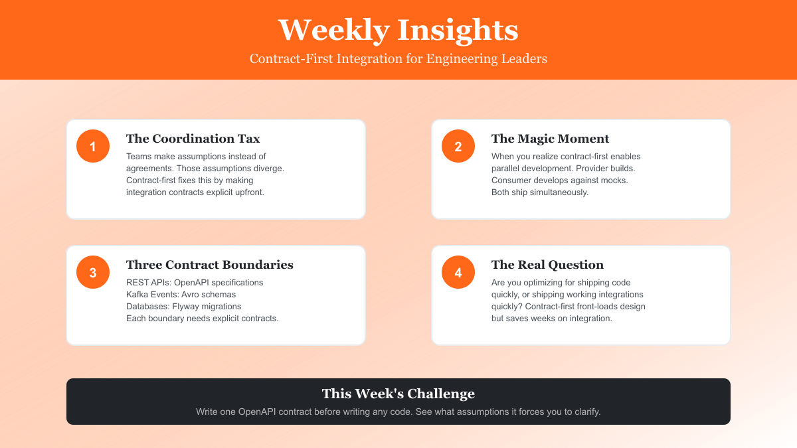

# Contract-First Integration: Insights for Engineering Leaders

## Why the best engineering teams define contracts before code (and what they learned the hard way)



*Today we're exploring contract-first integration—a pattern that separates high-performing engineering organizations from those constantly fighting integration fires.*

---

Hey everyone,

I want to talk about something that's been coming up in every architecture review I've been part of lately: How do you integrate distributed systems without creating a coordination nightmare?

I've seen three companies in the past month alone struggle with the same problem. They build microservices. They promise team autonomy. But then Team A can't ship because they're waiting for Team B's API. Team B can't finalize their API because they don't know exactly what Team C needs. Everyone's blocked. Velocity tanks.

Sound familiar?

There's a better way, and it's not new. Companies like Netflix, Uber, and Amazon figured this out years ago. They use contract-first development. But here's the thing—most teams I talk to either haven't tried it, or they tried it once, got frustrated with the overhead, and gave up.

I want to share what I've learned about making contract-first actually work in production. Not the theory. The real stuff. The patterns that work, the pitfalls to avoid, and the metrics that tell you if it's actually helping.

## The Problem Nobody Talks About

Here's what nobody tells you about microservices: The hard part isn't the code. The hard part is coordination.

When you have one monolith, integration is a method call. When you have 10 microservices and 30 engineers, integration is a multi-week project involving meetings, documentation, testing, debugging, and often some heated Slack conversations about who changed what.

Last month I was consulting with a fintech company. Eight microservices. Thirty-five engineers. They were trying to add a new order flow that touched four services. The estimate? Six weeks. The actual time? Twelve weeks.

Why?

Because they didn't define contracts upfront. Each team built what they thought the integration should look like. When they finally connected the services, nothing matched. Different field names. Different error codes. Different retry semantics. They spent six weeks debugging mismatched assumptions.

That's a $300,000 mistake (rough math: 8 engineers × 6 weeks × $12,500/week average loaded cost).

## What Contract-First Actually Means

Contract-first means you write the integration specification before you write any implementation code.

For REST APIs, that's an OpenAPI 3.0 spec.
For Kafka events, that's an Avro or Protobuf schema.
For databases, that's Flyway or Liquibase migrations.

The contract isn't documentation. It's the design specification. You generate server stubs from it. You generate client SDKs from it. You generate mocks from it. You validate your implementation against it in CI.

The contract is the single source of truth.

Here's a simple example. Instead of this (code-first):

```java
// Write controller first, hope it matches what consumers need
@PostMapping("/orders")
public Order createOrder(@RequestBody OrderRequest req) {
    // Implementation...
}
```

You do this (contract-first):

```yaml
# contracts/openapi/orders-api.yaml
openapi: 3.2.0
paths:
  /v1/orders:
    post:
      requestBody:
        required: true
        content:
          application/json:
            schema:
              type: object
              required: [customerId, items]
              properties:
                customerId:
                  type: string
                idempotencyKey:
                  type: string
                items:
                  type: array
                  items:
                    type: object
                    required: [sku, quantity]
                    properties:
                      sku: { type: string }
                      quantity: { type: integer, minimum: 1 }
      responses:
        '201':
          description: Order created
```

Then you implement code that conforms to this contract. And you set up CI to fail the build if someone tries to change the contract in a breaking way.

## The Magic Moment

The magic moment happens when you realize what this enables: **parallel development**.

Let me give you a real example from that fintech company I mentioned.

After the twelve-week disaster, they tried contract-first for their next integration. Here's what happened:

**Week 1: Contract design**
- Provider team (orders service) and consumer team (billing service) met for 90 minutes
- They designed the OpenAPI contract together
- Both teams reviewed and approved it

**Week 2-3: Parallel implementation**
- Orders team implemented the real API
- Billing team generated a client SDK from the contract and developed against a mock server
- Both teams worked simultaneously—no blocking

**Week 4: Integration**
- Billing team switched from mock server to real API (changed one config line)
- Everything worked on the first try
- Zero integration bugs

Four weeks instead of twelve. One coordination meeting instead of two dozen Slack conversations. Zero integration bugs instead of hunting down field name mismatches for three weeks.

The difference? They had a contract. Both teams implemented against the same specification. The contract was validated in CI. Breaking changes were caught in code review, not in production.

## The Three Contract Boundaries

In distributed systems, you have three integration boundaries. Each needs its own contract approach:

### 1. REST APIs: OpenAPI

Your API contract defines endpoints, request/response schemas, validation rules, error responses, and retry semantics.

The key insight here: Include idempotency in the contract.

```yaml
components:
  schemas:
    CreateOrderRequest:
      properties:
        idempotencyKey:
          type: string
          description: Optional UUID for safe retries
```

When clients can safely retry requests, your system is automatically more resilient. But idempotency only works if it's in the contract, not bolted on later.

### 2. Kafka Events: Avro Schemas

Event contracts define the shape of your events and—critically—how they evolve over time.

Here's the pattern I use:

```json
{
  "type": "record",
  "name": "OrderCreated",
  "fields": [
    {"name": "eventId", "type": "string"},
    {"name": "orderId", "type": "string"},
    {"name": "customerId", "type": "string"},
    {
      "name": "source",
      "type": ["null", "string"],
      "default": null
    }
  ]
}
```

Notice the `source` field. It's nullable with a default. This is backward compatible. Old consumers reading new events just ignore the field. New consumers reading old events get null.

This is how you evolve schemas without breaking consumers. Every new field must be optional or have a default.

### 3. Database Schemas: Flyway Migrations

Database schemas are contracts too. The pattern here is expand/migrate/contract:

```sql
-- V2: Expand (add nullable column)
ALTER TABLE orders ADD COLUMN source VARCHAR(32);

-- Application code: Migrate (backfill + new writes)
UPDATE orders SET source = 'UNKNOWN' WHERE source IS NULL;

-- V3: Contract (enforce NOT NULL after rollout)
ALTER TABLE orders ALTER COLUMN source SET NOT NULL;
```

This three-phase approach lets you deploy schema changes without downtime. Old code keeps working while new code rolls out gradually.

## What Actually Works in Production

I've implemented contract-first at three companies now. Here's what actually matters:

**1. Start with one integration**

Don't try to contract-first everything at once. Pick your most painful cross-team integration and do that one contract-first. Measure the difference. Use the data to convince others.

**2. Automate enforcement in CI**

Contracts are useless if they're not enforced. Add this to your GitHub Actions:

```yaml
- name: Check for breaking changes
  run: |
    npx openapi-diff \
      main:contracts/api.yaml \
      HEAD:contracts/api.yaml \
      --fail-on-breaking
```

Now breaking changes get caught in code review, not production. This is the enforcement mechanism that makes contracts real.

**3. Use Schema Registry for Kafka**

Don't just put Avro schemas in a repo and hope people validate them manually. Use Confluent Schema Registry. It enforces compatibility automatically. When someone tries to publish an incompatible schema, the producer fails at startup.

**4. Track the metrics that matter**

Don't measure lines of YAML written. Measure:
- Time to integration (weeks from start to production)
- Integration bugs in production (count per quarter)
- Cross-team coordination overhead (meetings per integration)
- Breaking change incidents (how many consumers broke)

These are the business metrics that matter.

## The Uncomfortable Conversation

Here's the part nobody wants to talk about: Contract-first requires teams to have hard conversations upfront.

When you sit down to write an OpenAPI contract, you can't wave your hands and say "we'll send customer data." You have to specify exactly which fields. You have to decide what happens when a field is missing. You have to agree on retry semantics.

These conversations are sometimes uncomfortable. People realize they don't actually know what they need yet. They have to make decisions before they've written code.

But here's the thing: Those conversations are going to happen either way. Either you have them upfront when the cost of change is low, or you have them three weeks later when both teams have already implemented conflicting assumptions.

Contract-first front-loads the coordination cost. But it dramatically reduces the total coordination cost.

## When Contract-First Doesn't Make Sense

I'm not dogmatic about this. There are times when contract-first is overkill:

**Prototyping**: If you're exploring the problem space and expect major pivots, formal contracts slow you down. Prototype first, contract later.

**Single-team ownership**: If one person owns both the provider and all consumers, the coordination cost is essentially zero. Skip the contract overhead.

**Rapid iteration**: If you're in that phase where you're shipping experiments daily and 80% of them get thrown away, contracts are premature.

But for production systems with multiple teams, different release schedules, and external consumers, contract-first is the only approach I've seen that scales past 10 engineers.

## The Real Question

The real question isn't "Should we use contract-first?"

The real question is: "Are we optimizing for shipping code quickly, or shipping working integrations quickly?"

Code-first feels faster upfront. You're writing Java on day one instead of "wasting time" on YAML specs.

But when you measure what actually matters—time to working integration, production bugs, team velocity—contract-first is dramatically faster.

The teams I see succeeding are the ones who realize that the bottleneck in distributed systems isn't code. It's coordination.

And contracts are how you scale coordination.

## What's New in the Ecosystem

A few recent developments related to contract-first patterns worth noting:

**AsyncAPI 3.0 release**: The team behind AsyncAPI (like OpenAPI but for event-driven systems) released 3.0. It adds better support for Kafka topics, CloudEvents, and NATS. If you're doing event-driven architecture, worth checking out.

**Spring Cloud Contract 4.1**: Recent release includes better integration with OpenAPI and improved stub generation. Makes contract testing easier in Spring Boot ecosystems.

**Confluent Schema Registry 8.1**: Added support for JSONSchema rules and improved backward compatibility checking. If you're using JSON instead of Avro for Kafka, this might be relevant.

## Try This Yourself

Here's what I'd suggest trying:

Pick one API integration your team is working on right now. Before you write any implementation code, spend 60 minutes writing the OpenAPI contract.

Just the contract. Define the endpoints, request/response schemas, validation rules, error responses.

Then ask yourself: How many assumptions did writing this contract force you to clarify? How many field name mismatches did you prevent? How many error cases did you identify upfront that would've been discovered in testing?

My guess: You'll find at least three things that would've caused integration bugs if you'd gone straight to code.

And that's the value. Not the YAML file. The forcing function that makes you clarify assumptions before they diverge.

## Further Reading

If you're interested in learning more about contract testing with Pact and how it differs from contract-first development, check out the additional resources in the repository. Understanding when to use each approach and how they complement each other is crucial for building robust integrations.

If you have questions about contract-first patterns, feel free to reach out. I read every message.

---

**Code Example Repository**

I've put together a complete working example showing contract-first integration with Spring Boot, OpenAPI, Kafka Avro, and Flyway migrations. It includes:

- Full OpenAPI specifications
- Spring Boot REST API implementation
- Kafka producer/consumer with Schema Registry
- Flyway database migrations
- CI/CD validation setup
- Metrics and observability

Check it out: [github.com/wallaceespindola/contract-first-integrations](https://github.com/wallaceespindola/contract-first-integrations)

---

**Related Topics**

If you found this helpful, you might also be interested in:
- Contract testing with Pact vs contract-first development
- Schema evolution patterns in production
- Handling required field additions to events in production systems

All explored with real examples from the trenches.

---

Thanks for reading. If this was helpful, share it with someone on your team who's dealing with integration headaches.

Wallace

---

**Connect:**
- [GitHub](https://github.com/wallaceespindola)
- [LinkedIn](https://www.linkedin.com/in/wallaceespindola/)
- [Speaker Deck](https://speakerdeck.com/wallacese)

**Get in touch** with questions, feedback, or topics you want me to explore. I read everything and respond to as many as I can.
