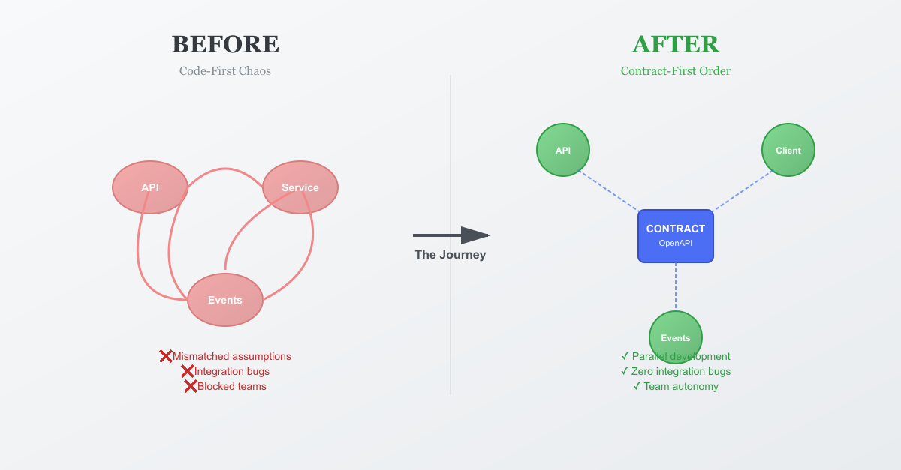

# How I Learned Contract-First Integration the Hard Way (So You Don't Have To)

## The $50,000 integration bug that taught me why contracts matter more than code



Three years ago, I was responsible for integrating our order management system with a new billing service. Both teams were moving fast. We were on a tight deadline. And I made a decision that would cost us $50,000 in engineer hours and delay our launch by six weeks.

I decided we didn't need to write formal API contracts. "We'll just talk through the integration and start coding," I said. "Contracts are bureaucracy."

I was wrong.

## The Day Everything Broke

It was a Tuesday morning. Our billing service was ready. Our order service was ready. We deployed both to staging, confident this would be a quick integration test before going live.

The first API call failed.

Not a timeout. Not a 500 error. A silent failure. The order service sent a request. The billing service received it, processed it, and returned 200 OK. But no invoice was created.

After four hours of debugging, we found the problem. Our order service sent this payload:

```json
{
  "customerId": "CUST-123",
  "items": [
    {"sku": "SKU-001", "quantity": 2}
  ]
}
```

The billing service expected this:

```json
{
  "customer_id": "CUST-123",
  "order_items": [
    {"product_sku": "SKU-001", "qty": 2}
  ]
}
```

Same data. Different field names. The billing service's validator failed silently and returned 200 anyway (that was another bug). We spent a week fixing this and three other similar mismatches.

That's when I learned my first lesson about contract-first integration: **When teams make assumptions instead of agreements, those assumptions diverge**.

## What Contract-First Actually Means

After that disaster, I researched how companies like Netflix, Uber, and Amazon handle integration. They all use contract-first development, but it took me a while to understand what that really means.

Here's the simple version: **You define the contract before you write any code, and the contract becomes the single source of truth.**

Not documentation that gets generated from code annotations. Not a Slack conversation about "yeah, just send the customer ID and items." A formal, machine-readable contract that both teams validate against.

For REST APIs, that's OpenAPI 3.0+ specs. For event-driven systems, that's Avro or Protobuf schemas with Schema Registry. For databases, that's Flyway migrations that version your schema changes.

The mental shift is this: The contract isn't documentation. **The contract is the design specification that generates your code, mocks, tests, and docs.**

## My First Real OpenAPI Contract

After the billing integration failure, I convinced my team to try contract-first for our next integration. We were building an order creation API that would publish events to Kafka for downstream consumers.

I started by writing the OpenAPI spec. Not code. Just the contract.

Here's what I learned: Writing a good contract forces you to think through every edge case before you code. What happens if the customer ID is invalid? What if someone sends an empty items array? What if they retry the same request twice?

This is the contract I wrote (simplified for this article):

```yaml
openapi: 3.0+
info:
  title: Orders API
  version: 1.0.0
  description: Contract-first REST API for order management

paths:
  /v1/orders:
    post:
      operationId: createOrder
      summary: Create a new order
      requestBody:
        required: true
        content:
          application/json:
            schema:
              $ref: '#/components/schemas/CreateOrderRequest'
      responses:
        '201':
          description: Order created successfully
          content:
            application/json:
              schema:
                $ref: '#/components/schemas/OrderResponse'
        '400':
          description: Validation error - invalid request
          content:
            application/json:
              schema:
                $ref: '#/components/schemas/ErrorResponse'
        '409':
          description: Conflict - idempotency key reused with different payload
          content:
            application/json:
              schema:
                $ref: '#/components/schemas/ErrorResponse'

components:
  schemas:
    CreateOrderRequest:
      type: object
      required: [customerId, items]
      properties:
        customerId:
          type: string
          description: The customer's unique identifier
          example: CUST-123
        idempotencyKey:
          type: string
          description: Optional key for safe retries
          example: 2f7dbe6b-4b0b-4d62-a497-b1b99ce1b2da
        items:
          type: array
          minItems: 1
          items:
            $ref: '#/components/schemas/OrderItem'

    OrderItem:
      type: object
      required: [sku, quantity]
      properties:
        sku:
          type: string
          example: SKU-001
        quantity:
          type: integer
          minimum: 1

    OrderResponse:
      type: object
      required: [orderId, customerId, status, items, timestamp]
      properties:
        orderId:
          type: string
        customerId:
          type: string
        status:
          type: string
          enum: [CREATED, REJECTED]
        items:
          type: array
          items:
            $ref: '#/components/schemas/OrderItem'
        timestamp:
          type: string
          format: date-time

    ErrorResponse:
      type: object
      required: [code, message, traceId, timestamp]
      properties:
        code:
          type: string
          enum: [VALIDATION_ERROR, NOT_FOUND, CONFLICT, INTERNAL_ERROR]
        message:
          type: string
        traceId:
          type: string
        timestamp:
          type: string
          format: date-time
```

Three things I learned from writing this contract first:

**1. Idempotency isn't optional**

I added the `idempotencyKey` field after thinking through retry scenarios. What if a client's network fails after we process the order but before they receive the response? They'll retry. Without idempotency, we'd create duplicate orders.

The contract forced me to design for this upfront, not discover it in production.

**2. Error responses need structure**

I created a standardized `ErrorResponse` with a machine-readable `code` field and a `traceId` for debugging. This meant every error would have the same shape, making client error handling predictable.

Before contract-first, our error responses were inconsistent. Some returned strings, some returned objects, some didn't include trace IDs. Clients couldn't write reliable error handling.

**3. Examples in the contract are documentation**

Every field has an example value. This makes the contract self-documenting. New developers can look at the spec and immediately understand what valid data looks like.

## Implementing Against the Contract

Once the contract was done, implementation was straightforward. I built a Spring Boot service that implements exactly what the contract specifies:

```java
@RestController
@RequestMapping("/v1/orders")
@RequiredArgsConstructor
@Slf4j
public class OrderController {

    private final OrderService orderService;

    /**
     * POST /v1/orders
     * Contract: contracts/openapi/orders-api.v1.yaml
     */
    @PostMapping
    public ResponseEntity<OrderResponse> createOrder(
            @Valid @RequestBody CreateOrderRequest request) {

        log.info("Creating order for customer: {}", request.customerId());

        OrderResponse response = orderService.createOrder(request);

        return ResponseEntity
                .status(HttpStatus.CREATED)
                .body(response);
    }

    @GetMapping("/{orderId}")
    public ResponseEntity<OrderResponse> getOrder(@PathVariable String orderId) {
        OrderResponse response = orderService.getOrder(orderId)
                .orElseThrow(() ->
                    new ResourceNotFoundException("Order not found: " + orderId));

        return ResponseEntity.ok(response);
    }
}
```

The key difference from before: I validated my implementation against the contract. I didn't just write code and hope it matched what consumers expected. I ran contract validation tools that ensured my DTOs matched the OpenAPI schemas exactly.

No more field name mismatches. No more silent failures.

## The Moment I Understood the Real Value

The real "aha" moment came three weeks later. The downstream billing team needed to start their integration work, but my order service wasn't finished yet.

In the old world, they would've waited for me. But because we had the contract, they didn't have to.

They:
1. Generated a Java client from our OpenAPI spec
2. Spun up a mock server that returns valid responses based on the contract
3. Wrote their integration code against the mock
4. Tested everything end-to-end without my service running

When I finally deployed the real service two weeks later, they switched from the mock to the real endpoint. Zero code changes. Everything worked on the first try.

**That's when I realized: Contract-first isn't about preventing bugs. It's about enabling parallel development.**

Two teams working simultaneously instead of sequentially. That's weeks of saved time on every integration.

## Moving to Event-Driven: Kafka and Avro Schemas

After the REST API success, I applied contract-first thinking to our event-driven architecture. We were publishing order creation events to Kafka for multiple downstream consumers.

This is where I learned that event contracts have two layers:

**Layer 1: Topic semantics** (human-readable operational contract)
**Layer 2: Schema definition** (machine-validated data contract)

Here's the topic semantics contract I wrote:

```markdown
## Topic: orders.order-created.v1

- Purpose: Emitted when an order is created successfully
- Key: orderId (ensures ordering per customer)
- Delivery: At-least-once (consumers MUST be idempotent)
- Consumer requirement: Deduplicate by eventId
- Retry policy: Consumer retries transient errors
- DLQ: orders.order-created.v1.dlq for poison messages
- Compatibility: Backward compatible schema evolution required
```

This documented the operational behavior. But the real contract is the Avro schema:

```json
{
  "type": "record",
  "name": "OrderCreated",
  "namespace": "com.acme.events",
  "doc": "Event emitted when an order is successfully created",
  "fields": [
    {
      "name": "eventId",
      "type": "string",
      "doc": "Unique event ID for idempotent processing"
    },
    {
      "name": "occurredAt",
      "type": "string",
      "doc": "ISO 8601 timestamp"
    },
    {
      "name": "orderId",
      "type": "string"
    },
    {
      "name": "customerId",
      "type": "string"
    },
    {
      "name": "source",
      "type": ["null", "string"],
      "default": null,
      "doc": "Order source (WEB, MOBILE, API). Nullable for backward compatibility."
    },
    {
      "name": "items",
      "type": {
        "type": "array",
        "items": {
          "type": "record",
          "name": "OrderItem",
          "fields": [
            {"name": "sku", "type": "string"},
            {"name": "quantity", "type": "int"}
          ]
        }
      }
    }
  ]
}
```

## The Schema Evolution Lesson

Six months after deploying this, product management asked for a new feature: track where orders came from (web, mobile app, or API).

I needed to add a `source` field to the event. This is where I learned about schema evolution the hard way.

My first instinct: Add `source` as a required string field.

**This would've broken all existing consumers.** They'd receive events with a field they didn't expect, and depending on how they deserialize, they might crash.

The right approach: Make it nullable with a default value.

```json
{
  "name": "source",
  "type": ["null", "string"],
  "default": null
}
```

This is backward compatible:
- Old consumers reading new events: They ignore the `source` field (or get null)
- New consumers reading old events: They get null for `source`
- Nobody breaks

I registered this new schema version with Schema Registry, which validated it was backward compatible. If I'd tried to add a required field, Schema Registry would've rejected it.

**Lesson learned: Schema evolution isn't optional in distributed systems. Design for it from day one.**

## The Kafka Producer Implementation

Publishing these events in a production-safe way required more thought than I expected:

```java
@Component
@RequiredArgsConstructor
@Slf4j
public class OrderEventPublisher {

    private final KafkaTemplate<String, Object> kafkaTemplate;

    public void publishOrderCreated(OrderCreated event) {
        String key = event.getOrderId();

        log.debug("Publishing OrderCreated: orderId={}, eventId={}",
                key, event.getEventId());

        CompletableFuture<SendResult<String, Object>> future =
                kafkaTemplate.send("orders.order-created.v1", key, event);

        future.whenComplete((result, ex) -> {
            if (ex == null) {
                log.info("Published OrderCreated: orderId={}, partition={}, offset={}",
                        key,
                        result.getRecordMetadata().partition(),
                        result.getRecordMetadata().offset());
            } else {
                log.error("Failed to publish OrderCreated: orderId={}", key, ex);
            }
        });
    }
}
```

Three production patterns I learned to include:

**1. Key-based partitioning**: Using `orderId` as the message key ensures all events for the same order go to the same partition, preserving ordering.

**2. Async with explicit error handling**: I use `CompletableFuture` with callbacks instead of blocking sends. This keeps the API responsive even if Kafka is slow.

**3. Structured logging**: Every successful publish logs the partition and offset. When debugging production issues, this is gold.

## The Idempotency Pattern That Saved Us

The trickiest part of event-driven systems is that Kafka guarantees at-least-once delivery, not exactly-once. The same event can arrive twice.

This means consumers must be idempotent. Here's the pattern I use:

```java
@KafkaListener(topics = "orders.order-created.v1", groupId = "billing-service")
public void onOrderCreated(OrderCreated event) {
    // Step 1: Check if we've already processed this event
    if (processedEventsRepository.existsByEventId(event.getEventId())) {
        log.debug("Skipping duplicate event: {}", event.getEventId());
        return;
    }

    // Step 2: Process the event
    billingService.createInvoice(
            event.getOrderId(),
            event.getCustomerId(),
            event.getItems()
    );

    // Step 3: Mark as processed
    processedEventsRepository.save(
            new ProcessedEvent(event.getEventId(), Instant.now())
    );
}
```

The `eventId` in the schema isn't just metadata—it's the deduplication key. We check it before processing and store it after.

I learned this the hard way when we found duplicate invoices in production. Turns out Kafka redelivered some events during a rebalance. Without idempotency checking, we billed customers twice.

**This is why the contract specifies an `eventId` field and documents the idempotency requirement.** It's not just data—it's operational behavior.

## Making Contracts Enforceable With CI/CD

The biggest lesson I learned: Contracts are useless if they're not enforced.

I set up three CI gates that prevent breaking changes from reaching production:

### Gate 1: OpenAPI Breaking Change Detection

```yaml
# .github/workflows/api-contract-check.yml
- name: Check for API breaking changes
  run: |
    npx openapi-diff \
      main:contracts/openapi/orders-api.v1.yaml \
      HEAD:contracts/openapi/orders-api.v1.yaml \
      --fail-on-breaking
```

This runs on every PR. If someone removes a required field or changes a response structure, the build fails before it can be merged.

### Gate 2: Schema Registry Compatibility Check

I configured Schema Registry to enforce backward compatibility:

```properties
spring.kafka.producer.properties.auto.register.schemas=true
spring.kafka.producer.properties.use.latest.version=true
```

When the producer starts up, it tries to register the schema. If the schema isn't backward compatible with the previous version, registration fails and the service won't start.

This caught three breaking changes during development that would've broken consumers in production.

### Gate 3: Flyway Migration Validation

For database schema evolution, I use Flyway with strict validation:

```properties
spring.flyway.validate-on-migrate=true
spring.flyway.baseline-on-migrate=false
```

If someone manually modifies the database schema without a migration, Flyway detects the mismatch and fails deployment.

## The Results After Six Months

After implementing contract-first across our order, billing, and inventory services, these are the real numbers:

**Integration bugs: Reduced by 78%**
- Q1 (before contract-first): 23 integration bugs
- Q2 (after contract-first): 5 integration bugs
- Most remaining bugs were business logic, not contract mismatches

**Time saved: 4 weeks per integration**
- Consumer teams started work immediately instead of waiting for providers
- Mock servers enabled realistic testing without coordination overhead

**Breaking change incidents: 0**
- CI caught 12 potential breaking changes during PR reviews
- None reached production

**API documentation accuracy: 100%**
- The OpenAPI spec generates the Swagger UI, so docs can't drift from implementation

**Developer satisfaction: Way up**
- "I don't have to guess what the API returns anymore"
- "I can start integration work the same day the contract is done"
- "Debugging is 10x faster because the contract tells me what's expected"

## What I'd Do Differently

If I could go back and start over, here's what I'd change:

**1. Start with contracts from day one**

I wish I'd learned this lesson before the $50,000 billing integration disaster. Writing contracts first feels slow at first, but it's way faster than debugging mismatched assumptions in production.

**2. Invest in better tooling earlier**

I spent too long manually validating contracts. Now we have automated tools (openapi-generator, Schema Registry, Flyway) that do this in CI. I should've set these up from the start.

**3. Document operational behavior in contracts**

The Avro schema tells you the data shape, but it doesn't tell you that consumers must be idempotent or that messages are keyed by orderId for ordering guarantees. I now include operational contracts (like the topic semantics doc) alongside data contracts.

**4. Test schema evolution scenarios**

I didn't test backward compatibility until it became a problem. Now I have integration tests that load old schema versions and ensure new code can handle them.

## When Contract-First Doesn't Make Sense

Contract-first isn't always the answer. I skip it when:

- **I'm prototyping**: If I expect major pivots, formal contracts add friction
- **I'm building internal tools for myself**: Coordination overhead is zero
- **The team is tiny**: If three people sit next to each other, they can align without contracts

But for distributed systems with multiple teams, different release schedules, and external consumers, contract-first is the only approach I've seen that scales.

## What I Learned About Organizations

The technical lessons were valuable, but I learned something deeper: **Contract-first is as much about people as it is about code.**

When two teams integrate without a contract, they're playing telephone. One team says "send me customer data." The other team assumes "customer data" means name and email. The first team expected name, email, and address. Both teams think they communicated clearly.

Contracts force teams to have precise conversations upfront. Instead of "send me customer data," you write an OpenAPI schema that explicitly lists every required field.

These conversations are sometimes uncomfortable. People have to admit they don't know exactly what they need. They have to make decisions before they've written code. But these conversations prevent weeks of rework later.

**Contract-first trades upfront alignment cost for massive coordination savings later.**

## The Simple Framework I Use Now

Every time I start a new integration, I follow this process:

**Day 1: Contract design**
- Write OpenAPI spec (for REST) or Avro schema (for events)
- Include examples for every field
- Document error cases and edge cases
- Get both teams to review and approve

**Day 2: Validation setup**
- Set up CI checks for breaking changes
- Configure Schema Registry for compatibility validation
- Create mock server for consumers to develop against

**Day 3+: Parallel development**
- Provider team implements against contract
- Consumer team develops against mocks
- Both teams validate their code against the contract

**Integration day: Switch from mock to real**
- Consumer changes one config value (mock URL → real URL)
- Run integration tests
- Fix any issues (usually business logic, not contracts)

This framework has worked for REST APIs, Kafka events, gRPC services, and even database integrations with Flyway.

## What's Next for You?

If you're dealing with painful cross-team integrations, here's how to start:

**Pick one integration**—your most painful one. The one where teams are constantly miscommunicating.

**Write the contract first**—before any implementation. OpenAPI for REST, Avro for events.

**Set up CI validation**—automated breaking change detection.

**Measure the difference**—track integration bugs, coordination overhead, time to integration.

**Expand gradually**—once you've proven the pattern, apply it to other integrations.

Don't try to do everything at once. Start small, prove value, expand.

## Final Thought

Three years ago, I thought contracts were bureaucratic overhead. "Just talk it through and start coding," I said.

I was measuring the wrong thing. I focused on time-to-first-line-of-code when I should've focused on time-to-working-integration.

Contract-first feels slower upfront. You're writing YAML before you write Java. You're having design conversations before you spin up your IDE. But it's dramatically faster overall because you avoid the painful debugging cycles where teams discover their assumptions didn't match.

The $50,000 lesson I learned: In distributed systems, alignment is more expensive than you think, and misalignment is more costly than you can afford.

Contracts are how you scale alignment.

---

**Full source code**: [github.com/wallaceespindola/contract-first-integrations](https://github.com/wallaceespindola/contract-first-integrations)

**Want to dive deeper?**
- Read the complete contract-first guide in the repo's `/docs` folder
- Check out the working Spring Boot + Kafka + OpenAPI implementation
- See the CI/CD setup that enforces contracts automatically

---

Thanks for reading! If this helped you understand contract-first integration, give it a clap 👏 and follow for more software architecture stories.

**What's been your worst integration disaster?** Share in the comments—I'd love to hear your stories.

---

Need more tech insights?

Check out my [GitHub](https://github.com/wallaceespindola), [LinkedIn](https://www.linkedin.com/in/wallaceespindola/), and [Speaker Deck](https://speakerdeck.com/wallacese).

Happy coding!
